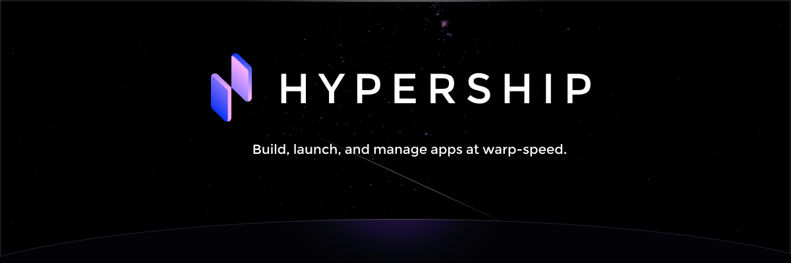
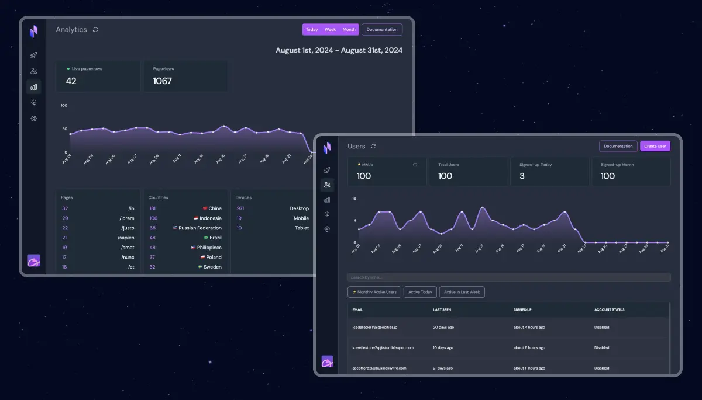

  

    Hypership is a new platform to build, launch, and manage your web-apps with user authentication, deployments, analytics and events out of the box.
  

  

    Find out more at <a href="https://hypership.dev">hypership.dev</a>
  

  
Join our community on <a href="https://discord.gg/BD35TJ2M" style="display: inline-flex; align-items: center;"> Discord</a>

## Getting Started

The easiest way to get started is to sign-up for Hypership at [https://hypership.dev/signup](https://hypership.dev/signup).

You can build with Hypership completely free.

Within seconds, you can have a web-app deployed with user authentication, analytics, and event tracking.

There is a handy quick-start guide after you create your first Hypership project, showing you how to pull down the codebase of your first app.

## What is Hypership?

Hypership is both a platform and a set of SDKs.

The platform is where you can manage your projects, users, events, analytics, and project settings.

The SDKs are what you use to build your app.

## Services

Hypership v1 has SDKs and support for:

- **Deployments**: Easily deploy new version of your app with a single command.

- **User Authentication**: Securely manage user sign-ups, logins, and access control.

- **Analytics**: Track page views, user activity, and more. Get detailed info on what users are doing and what's happening in your app, so you can make things better and more reliable.

- **Events**: Keep tabs on any event you care about. Get detailed info on what users are doing and what's happening in your app, so you can make things better and more reliable.

- **Linked Data**: Page views and events are automatically linked to your users, so you can see what users are doing and what's happening in your app, with no extra work.

## SDKs

We currently have support for React, meaning you can use Hypership with any React framework (Next.js, RedwoodJS, etc).

The React SDK is hosted on NPM, therefore you can simply run for example: `npm i @hypership/auth-react`.

The full list of React packages are:

- [@hypership/auth-react](https://www.npmjs.com/package/@hypership/auth-react)
- [@hypership/analytics-react](https://www.npmjs.com/package/@hypership/analytics-react)
- [@hypership/events-react](https://www.npmjs.com/package/@hypership/events-react)

## Next Steps

It's so easy to get started with Hypership. Within literally seconds you can have a web-app deployed with user authentication, analytics, and event tracking.

- [Sign up for Hypership](https://hypership.dev/signup)
- [Jump into our Discord community](https://discord.gg/BD35TJ2M)
- Create your first Hypership project and start shipping at warp-speed!
