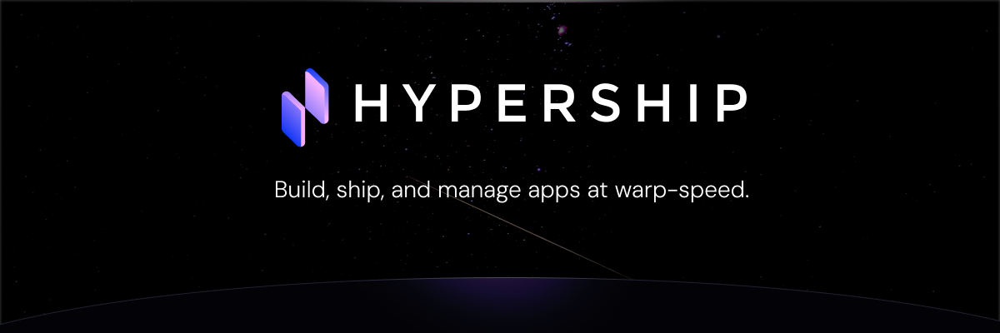

# @hypership/auth-react



<div align="center">
  <p>
    Hypership is a new platform to build, ship, and manage apps at warp-speed. We give you a full codebase deployed with user authentication, pageview analytics, event tracking, and deployments out of the box.
  </p>
  <p>
    Find out more at <a href="https://hypership.dev">hypership.dev</a>
  </p>

[](https://discord.gg/R2KHzFqGjN)

</div>

A powerful and flexible authentication SDK for React applications, part of the Hypership platform.

## Installation

```bash
npm install @hypership/auth-react
```

## Features

- 🔐 Complete authentication flow (Sign In, Sign Up, Password Reset)
- 📧 Email verification and account confirmation
- 🔄 Password reset and change functionality
- 🌓 Built-in light/dark theme support
- 🚀 GitHub OAuth integration
- 🎨 Customizable UI components
- 🔒 Secure token management
- 🌐 Automatic token refresh
- 📱 Responsive design

## Quick Start

1. Wrap your app with the `HypershipAuthProvider`:

```jsx
import { HypershipAuthProvider } from "@hypership/auth-react";

function App() {
  return (
    <HypershipAuthProvider apiKey="your-hypership-api-key">
      <YourApp />
    </HypershipAuthProvider>
  );
}
```

2. Use the authentication flow component:

```jsx
import { AuthFlow } from "@hypership/auth-react";

function LoginPage() {
  const handleAuthSuccess = () => {
    // Handle successful authentication
  };

  return <AuthFlow onAuthSuccess={handleAuthSuccess} />;
}
```

## Using the Hook

Access authentication state and methods using the `useHypershipAuth` hook:

```jsx
import { useHypershipAuth } from "@hypership/auth-react";

function YourComponent() {
  const {
    user,
    isAuthenticated,
    signIn,
    signUp,
    signOut,
    error,
    theme,
    toggleTheme,
  } = useHypershipAuth();

  // Use the authentication state and methods
}
```

## Available Components

- `AuthFlow`: Complete authentication flow UI
- `SignIn`: Standalone sign-in component
- `SignUp`: Standalone sign-up component
- `PasswordReset`: Password reset flow
- `ConfirmUserAccount`: Account confirmation component
- `Private`: Protected route wrapper

## Theme Support

The SDK supports both light and dark themes out of the box:

```jsx
<HypershipAuthProvider apiKey="your-api-key" theme="dark">
  <YourApp />
</HypershipAuthProvider>
```

## API Reference

### HypershipAuthProvider Props

| Prop     | Type              | Required | Description                         |
| -------- | ----------------- | -------- | ----------------------------------- |
| apiKey   | string            | Yes      | Your Hypership API key              |
| theme    | 'light' \| 'dark' | No       | Initial theme (defaults to 'light') |
| children | ReactNode         | Yes      | Child components                    |

### useHypershipAuth Hook

Returns an object with:

- Authentication State:

  - `user`: Current user object or null
  - `isAuthenticated`: Boolean indicating auth status
  - `error`: Error message or null
  - `theme`: Current theme ('light' or 'dark')

- Loading States:

  - `signingIn`: Loading state for sign-in
  - `signingUp`: Loading state for sign-up
  - `authenticating`: Loading state for initial auth
  - `passwordResetting`: Loading state for password reset
  - `confirmingAccount`: Loading state for account confirmation

- Methods:
  - `signIn(email: string, password: string): Promise<void>`
  - `signUp(email: string, password: string): Promise<void>`
  - `signOut(): Promise<void>`
  - `passwordReset(email: string): Promise<void>`
  - `confirmAccount(email: string, code: string): Promise<void>`
  - `signInWithGithub(): Promise<void>`
  - `toggleTheme(): void`

## License

ISC
